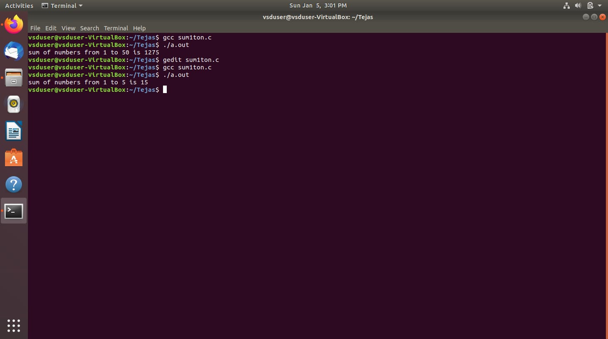

#  Samsung-RISCV

This hands-on program helps participants learn **RISC-V** and **Semiconductor technologies** through practical training. It covers **VLSI chip design** and **RISC-V architecture** using open-source tools, with guidance from **Kunal Ghosh** to develop practical skills.

##  Basic Details

**Name:** TEJAS M 

**College:** Vidya Vardhaka College of Engineering

**Email ID:** tejasmanjunath381@gmail.com 

**LinkedIN Profile:** www.linkedin.com/in/tejas---m

----------------------------------------------------------------------------------------------------------------

<details>
<summary><b>Task 1:</b> Install the RISC-V toolchain using the VDI link, then compile the C code using both the normal GCC compiler and the RISC-V GCC compiler to compare the results. Refer to the provided C-based and RISC-V lab videos for guidance on completing the task.</summary>   
<br>
  
**C Program**

We start by creating a file in our directory using a simple editor like Leafpad. After writing the program to calculate the sum of numbers from 1 to n, save the file, close the editor, and compile it using GCC. Once compiled, you can run the program to fetch the output.

### Program to calculate 1 to n numbers
```
#include<stdio.h>
int main()
{
  int i, sum=0, n=50;
  for(i=0;i<=n;++i)
    {
      sum+=i;
    }
  printf("Sum of numbers from 1 to %d is %d\n",n,sum);
  return 0;
}
```

**Commands used to compile and fetch the output are**
```
gcc sum1ton.c
./a.out

```


